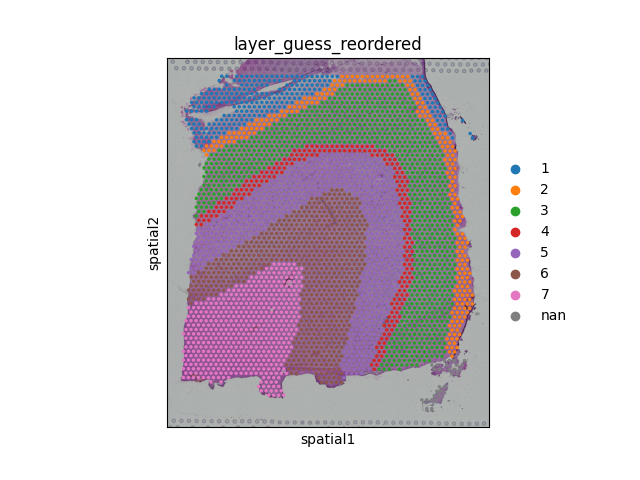
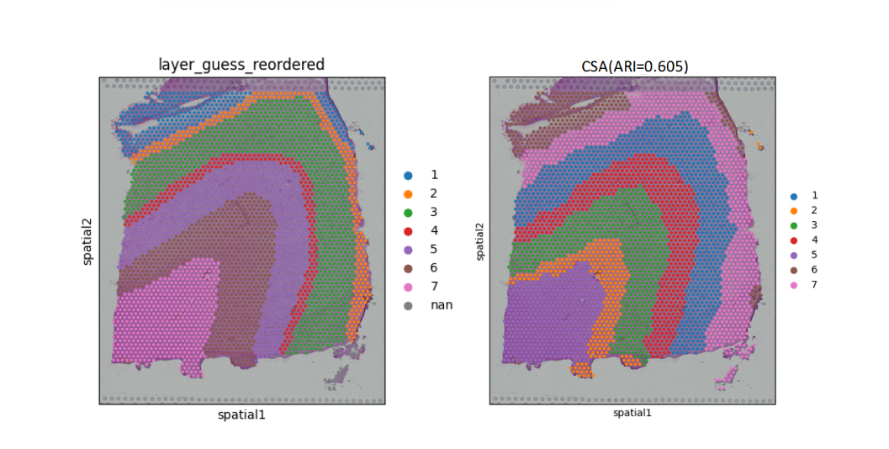
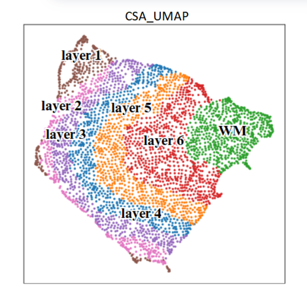
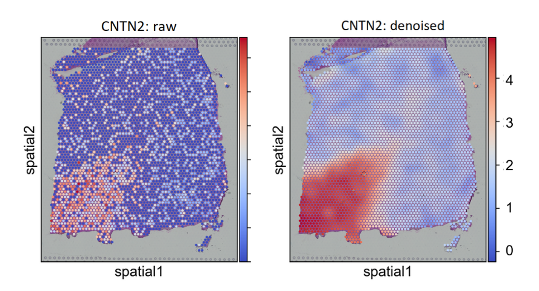
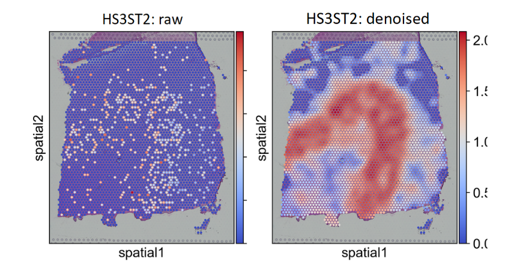
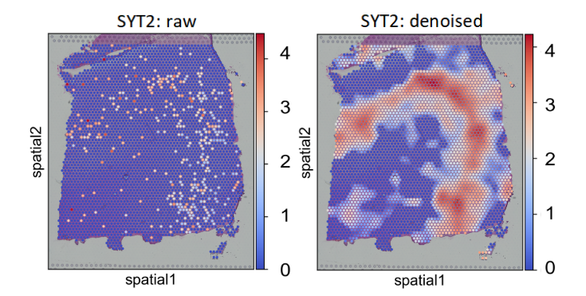
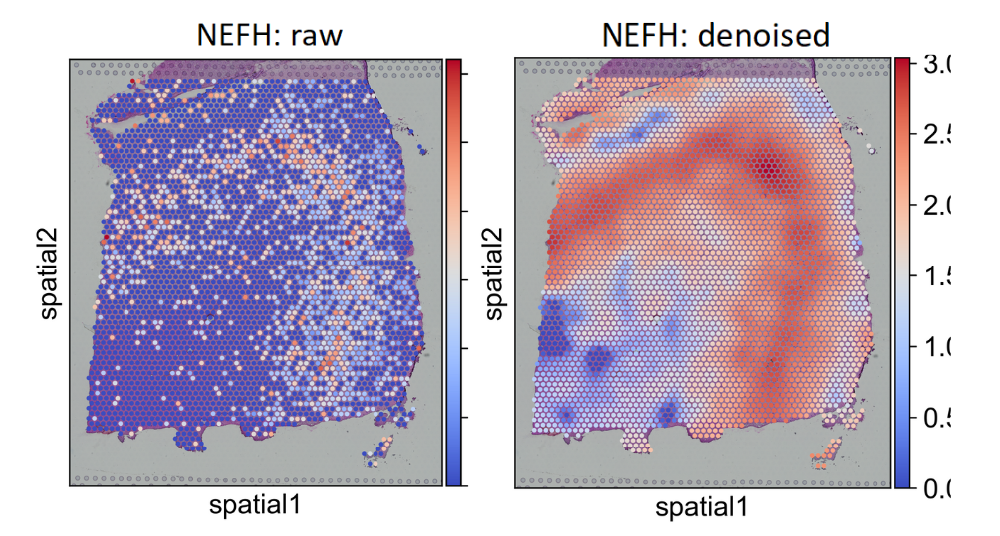
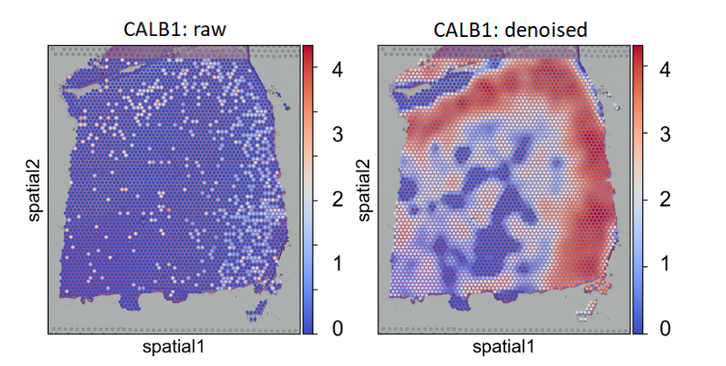
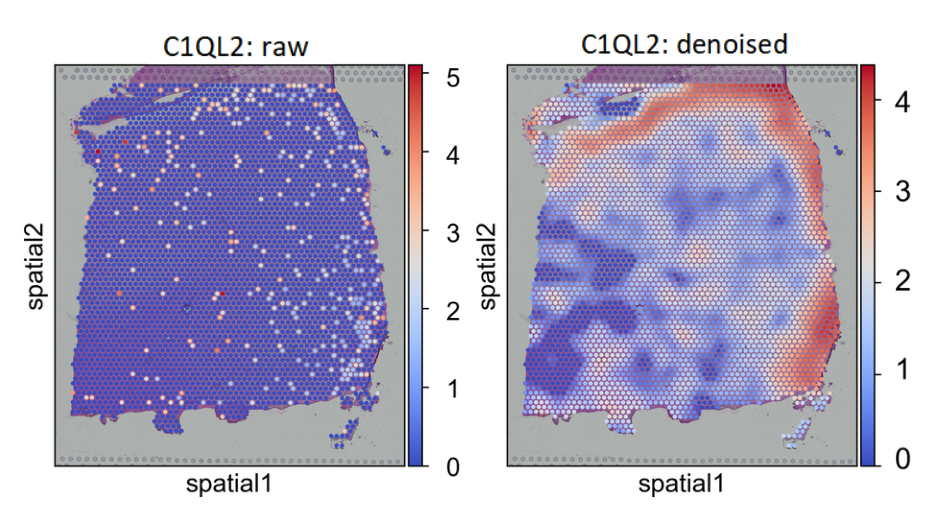
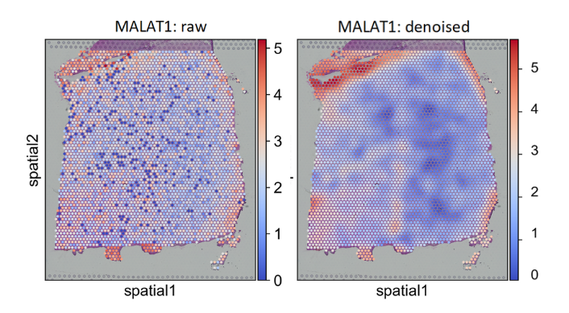

Tutorial 1: 10x Visium dorsolateral prefrontal cortex dataset
===============================================================
We provide our benchmarking workflow for re-analysis on 10x Visium dorsolateral prefrontal cortex dataset. Specifically, 
we select the section 151673 as a sample. DLPFC layers and white matter (WM) have been manually annotated based 
on the morphological features and gene markers in the previous research by Maynard et al.

Dataset access
----------------

The processed data is available at https://github.com/LieberInstitute/spatialLIBD

Package preparation
----------------------

.. code-block:: python

    import warnings
    import util
    import scanpy as sc
    import matplotlib as plt
    warnings.filterwarnings("ignore")
    device = 'cuda' if torch.cuda.is_available() else 'cpu'
    slice = '151673'
    plt.rcParams["figure.figsize"] = (5, 5)

Read and preprocess the DLPFC dataset 
----------------------------------------
.. code-block:: python

    adata = sc.read_visium(path='/.../matrix/{}/'.format(inx),
                               count_file='{}_filtered_feature_bc_matrix.h5'.format(inx))
    print('reading data...')
    label_pth = '/.../truth/{}_truth.txt'.format(inx)
    # read labels
    with open(label_pth, 'r') as file:
        lines = file.readlines()
    import pandas as pd
    domain_arr = []
    for line in lines:
        elements = line.strip().split()
        if len(elements) == 1:
            domain_arr.append([elements[0], -1])
        else:
            domain_arr.append([elements[0], elements[1]])
    # transfer labels into discrete value
    np_arr = np.array(domain_arr)
    label_match_df = pd.DataFrame(np_arr)
    domain_dict = {'WM': '7', 'Layer_1': '1', 'Layer_2': '2', 'Layer_3': '3',
                   'Layer_4': '4', 'Layer_5': '5', 'Layer_6': '6'}
    label_match_df[1] = label_match_df[1].map(domain_dict)
    labels = label_match_df[1].values

    adata.obs['layer_guess_reordered'] = labels
    adata.obs['layer_guess_reordered'] = adata.obs['layer_guess_reordered'].astype('str').astype('category')

Visualize the annotated image
-------------------------------
.. code-block:: python

    sc.pl.spatial(adata,
                  color=['layer_guess_reordered'],
                  title=['Ground truth'],
                  img_key='hires',
                  spot_size=100)

Run CSA
-------

.. code-block:: python

    import Train_CSA
    import util
    adata = train_CSA(adata, device=device)    
    sc.pp.neighbors(adata, use_rep='CSA')
    # mclust
    
    util.mclust_R(adata, num_cluster=num_cluster, modelNames='EEE', use_rep='CSA')
    # calculate ARI score
    domains = adata.obs['mclust'].cat.codes
    labels = adata.obs['layer_guess_reordered']
    ari = adjusted_rand_score(labels, domains)
    sc.pl.spatial(adata,
                  color=['mclust', 'layer_guess_reordered'],
                  title=['CSA(ARI = %.3f)' % ari, 'Ground truth'],
                  img_key='hires',
                  spot_size=100)

Perform Uniform Manifold Approximation and Projection (UMAP)
-----------------------------------------------------------------
.. code-block:: python

    sc.pl.umap(adata, color='mclust', title='CSA_UMAP')

Visualize data denoising results
---------------------------------
Since we have provided the automatical storing of the reconstructed adata, you may just set the default storing 
path of it in Train_CSA.py.

.. code-block:: python

    marker_list = ['CNTN2', 'HS3ST2', 'SYT2', 'NEFH', 'CALB1', 'C1QL2', 'MALAT1']
    rec_adata = sc.read_h5ad('.../rec_adata.h5ad')

    for gene in marker_list:
        gene_exp = adata[:, gene].X.toarray().flatten()
        rec_exp = rec_adata[:, gene].X.toarray().flatten()
        adata.obs['gene_exp'] = gene_exp
        adata.obs['rec_exp'] = rec_exp
        sc.set_figure_params(dpi_save=300, dpi=300)
        sc.pl.spatial(adata, spot_size=100, color=['gene_exp', 'rec_exp'],
                        cmap='coldwarm', show=True,
                         title=[gene+': raw', gene+': denoised'])
    

Below is the comparison between raw pattern and denoised pattern of marker gene CNTN2.

Below is the comparison between raw pattern and denoised pattern of marker gene HS3ST2.

Below is the comparison between raw pattern and denoised pattern of marker gene SYT2.

Below is the comparison between raw pattern and denoised pattern of marker gene NEFH.

Below is the comparison between raw pattern and denoised pattern of marker gene CALB1.

Below is the comparison between raw pattern and denoised pattern of marker gene C1QL2.

Below is the comparison between raw pattern and denoised pattern of marker gene MALAT1.

