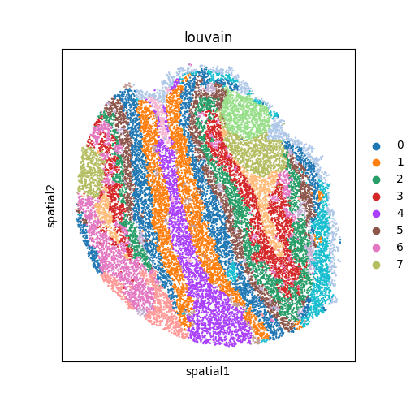
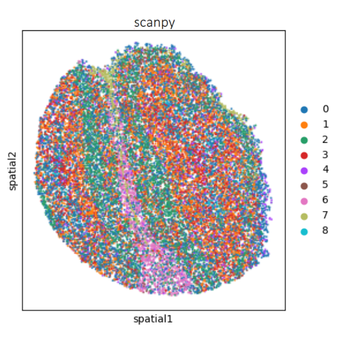
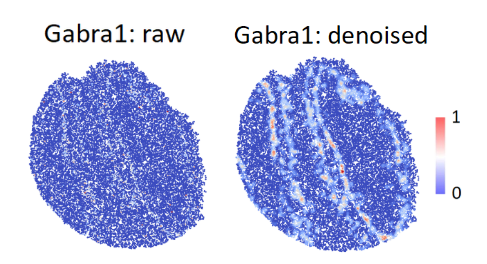
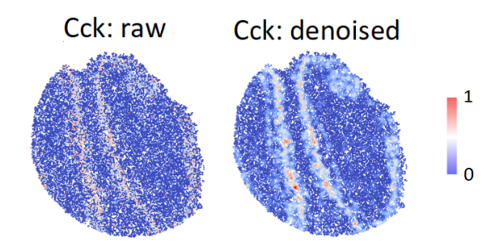
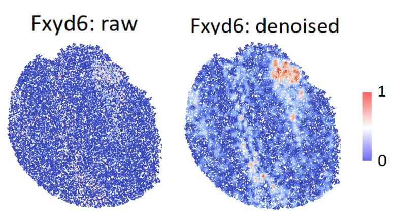
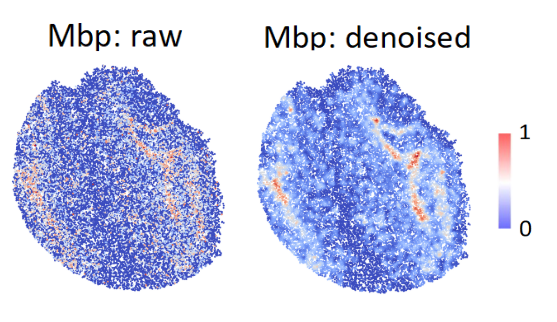
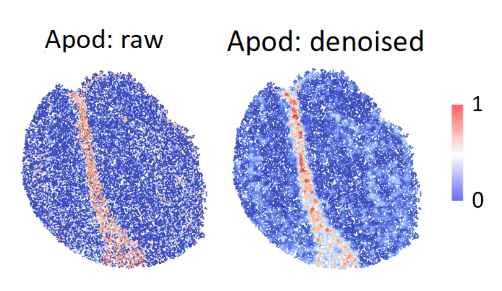
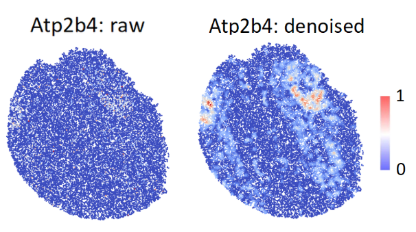
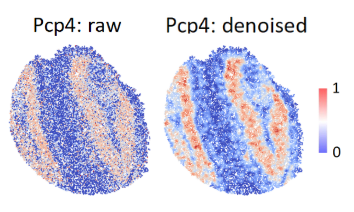
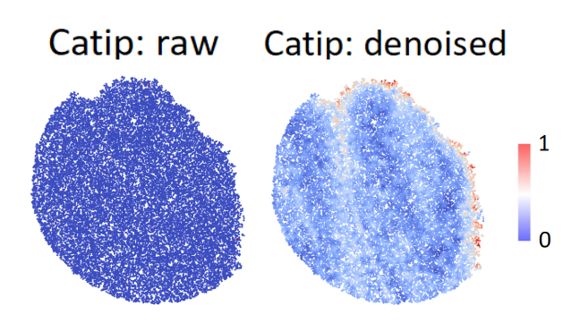

Tutorial 2: Slide-seqV2 (mouse olfactory bulb dataset) 
=================================================

Dataset access
----------------

The processed data is available at https://singlecell.broadinstitute.org/single_cell/study/SCP815/highly-sensitive-spatial-transcriptomics-at-near-cellular-resolution-with-slide-seqv2#study-summary

Package preparation
----------------------

.. code-block:: python

    import warnings
    import util
    import scanpy as sc
    import matplotlib as plt
    warnings.filterwarnings("ignore")
    device = 'cuda' if torch.cuda.is_available() else 'cpu'
    plt.rcParams["figure.figsize"] = (5, 5)
    import os
    import sys
    import pandas as pd
    import numpy as np

Read MOB data
-----------------

.. code-block:: python

    # input adata
    in_dir = '/'
    counts_file = os.path.join(in_dir, 'Puck_200127_15.digital_expression.txt')
    coor_file = os.path.join(input_dir, 'Puck_200127_15_bead_locations.csv')
    counts = pd.read_csv(counts_file, sep='\t', index_col=0)
    coordata_frame = pd.read_csv(coor_file, index_col=0)
    # load coordinations
    adata = sc.AnnData(counts.T)
    adata.var_names_make_unique()
    coordata_frame = coordata_frame.loc[adata.obs_names, ['xcoord', 'ycoord']]
    adata.obsm["spatial"] = coor_df.to_numpy()
    sc.pp.calculate_qc_metrics(adata, inplace=True)

    sc.pp.filter_genes(adata, min_cells=50)

    # select and normalize 
    sc.pp.highly_variable_genes(adata, flavor="seurat_v3", n_top_genes=3000)
    sc.pp.normalize_total(adata, target_sum=1e4)
    sc.pp.log1p(adata)

Run CSA
----------------

.. code-block:: python

    adata = train_CSA(adata, device=device)
    sc.pp.neighbors(adata, use_rep='CSA')
    print("Performing domain clustering...")
    sc.settings.set_figure_params(dpi=300, dpi_save=300)
    # cluster by louvain
    sc.tl.louvain(adata, resolution=1)
    sc.pl.spatial(adata, spot_size=35, color='louvain', show=True)

benchmarking of scanpy
-------------------------

.. code-block:: python

    sc.pp.pca(adata, n_comps=30)
    sc.pp.neighbors(adata, use_rep='X_pca')
    sc.tl.louvain(adata, resolution=0.8)
    sc.pl.spatial(adata, title='scanpy', spot_size=35, color='louvain', show=True)

Visualize data denoising results
---------------------------------

.. code-block:: python

    marker_list = ['Gabra1', 'Cck', 'Fxyd6', 'Mbp', 'Apod', 'Atp2b4', 'Pcp4', 'Catip']
    rec_adata = sc.read_h5ad('../rec_adata.h5ad')

    for gene in marker_list:
        gene_exp = adata[:, gene].X.toarray().flatten()
        rec_exp = rec_adata[:, gene].X.toarray().flatten()
        adata.obs['gene_exp'] = gene_exp
        adata.obs['rec_exp'] = rec_exp
        sc.set_figure_params(dpi_save=300, dpi=300)
        sc.pl.spatial(adata, spot_size=35, color=['gene_exp', 'rec_exp'],
                        cmap='coldwarm', show=True,
                         title=[gene+': raw', gene+': denoised'])

Below is the comparison between raw pattern and denoised pattern of marker gene Gabra1.

Below is the comparison between raw pattern and denoised pattern of marker gene Cck.

Below is the comparison between raw pattern and denoised pattern of marker gene Fxyd6.

Below is the comparison between raw pattern and denoised pattern of marker gene Mbp.

Below is the comparison between raw pattern and denoised pattern of marker gene Apod.

Below is the comparison between raw pattern and denoised pattern of marker gene Atp2b4.

Below is the comparison between raw pattern and denoised pattern of marker gene Pcp4.

Below is the comparison between raw pattern and denoised pattern of marker gene Catip.

